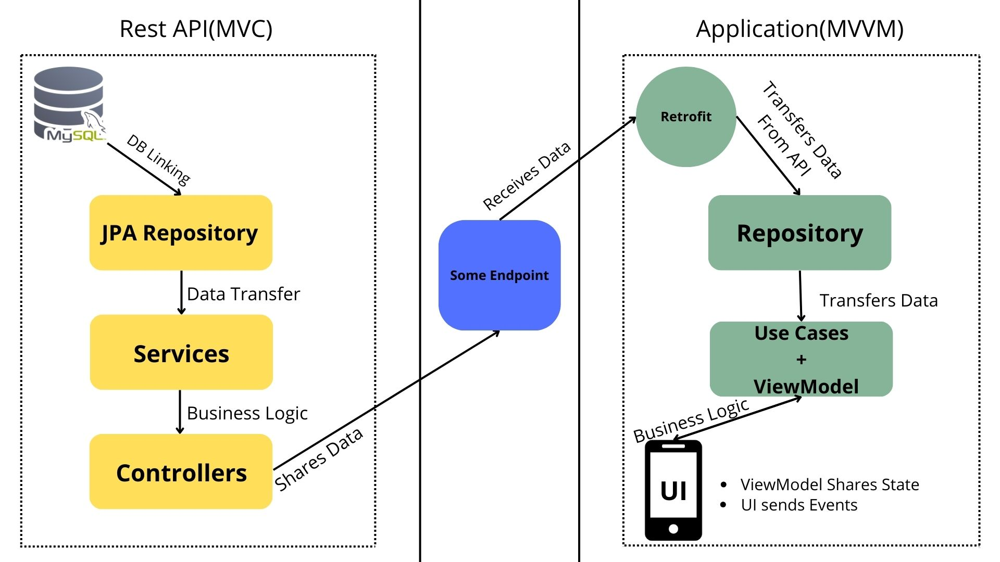

# Evangelion Wiki App

Evangelion Wiki App is fullstack Android App with BE written in kotlin

## Architecture

## Back End

- BE is Rest API with simple get endpoints
- Data contains in local MySQL data base
- Rest Api is written using kotlin Spring Boot framework
- Unit tests are written using JUnit 5

## Android App

- Native Android App is written in kotlin
- For UI Jetpack Compose is used
- Architecture is MVVM
- For exceptions handling Either library is used

## Todo

- Create unit and ui tests for Android app
- Add more data to DB
- Structurise data more efficient